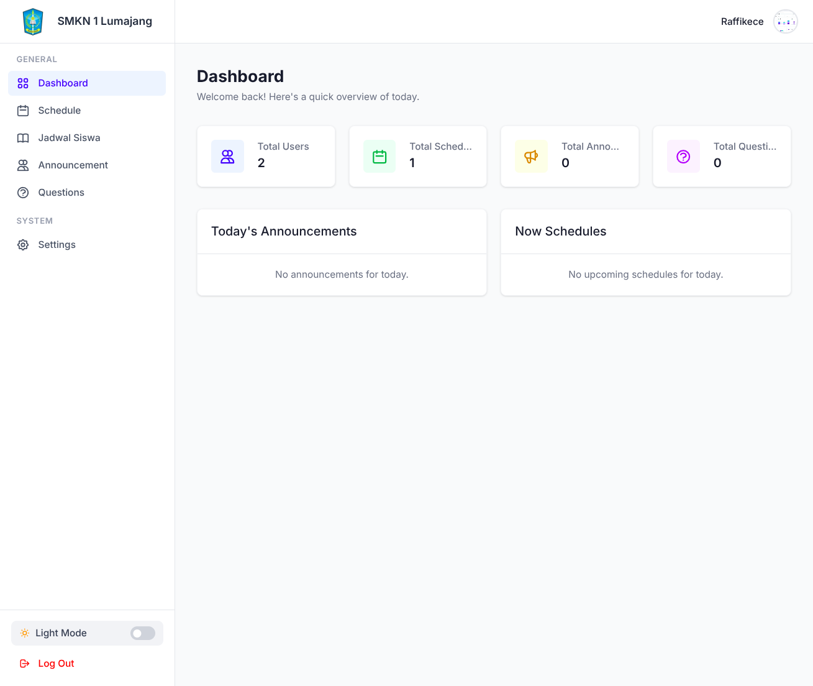
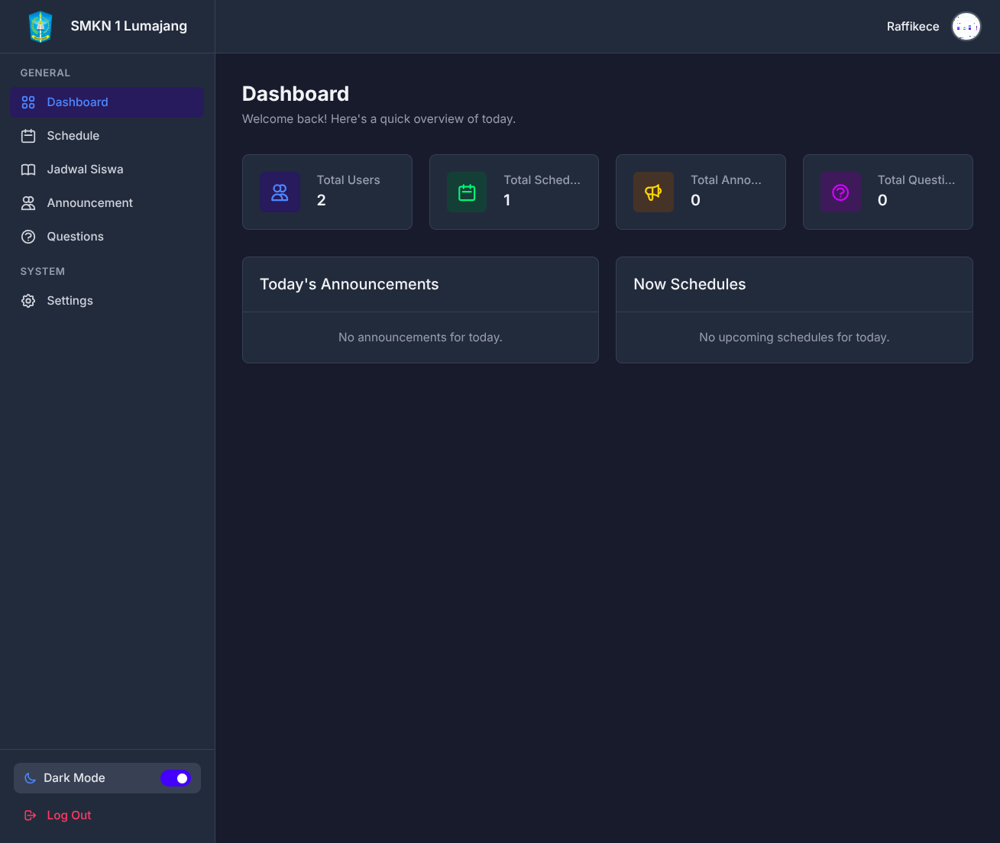
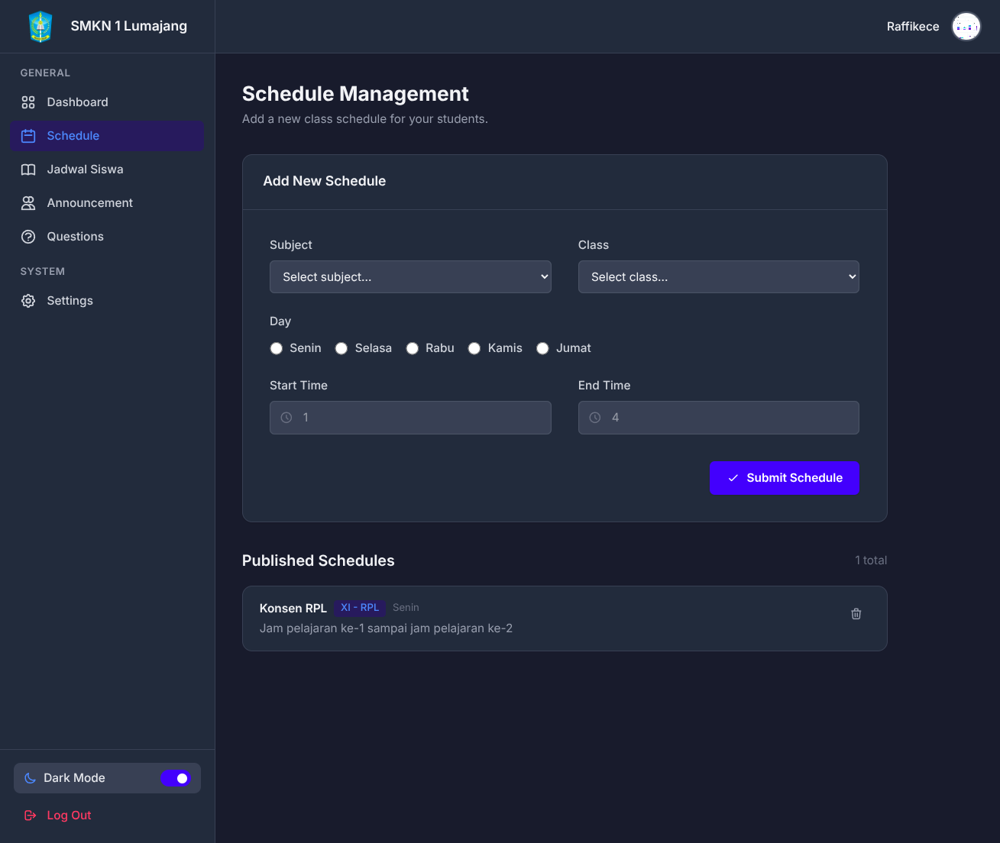
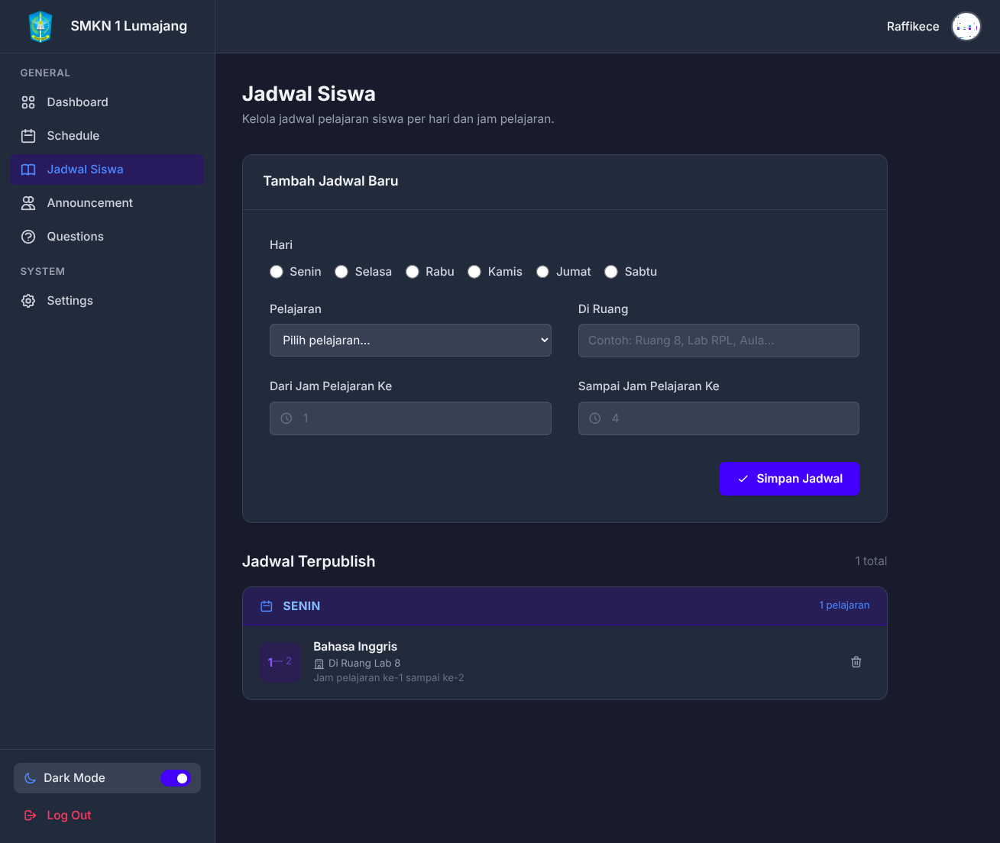
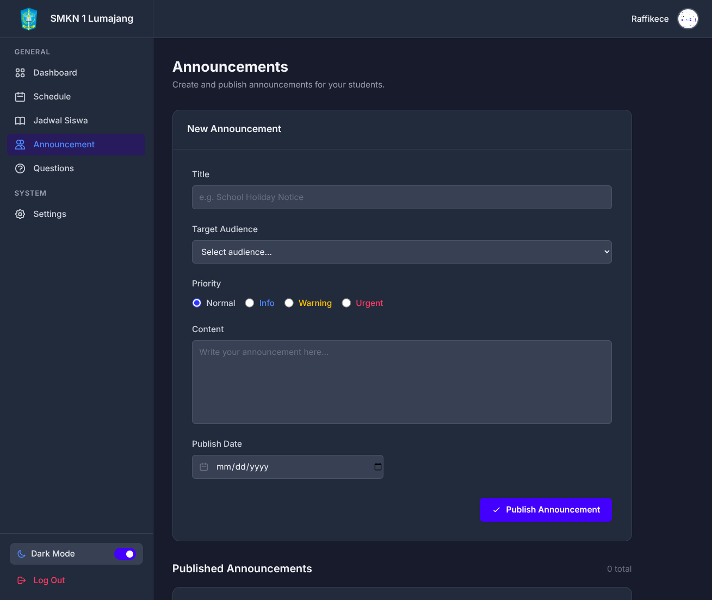
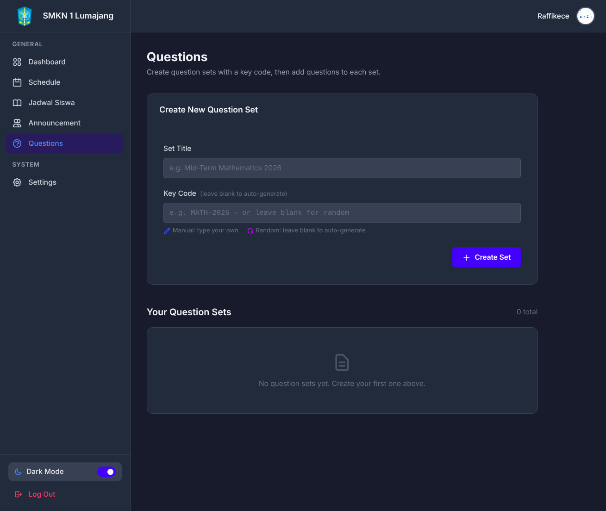
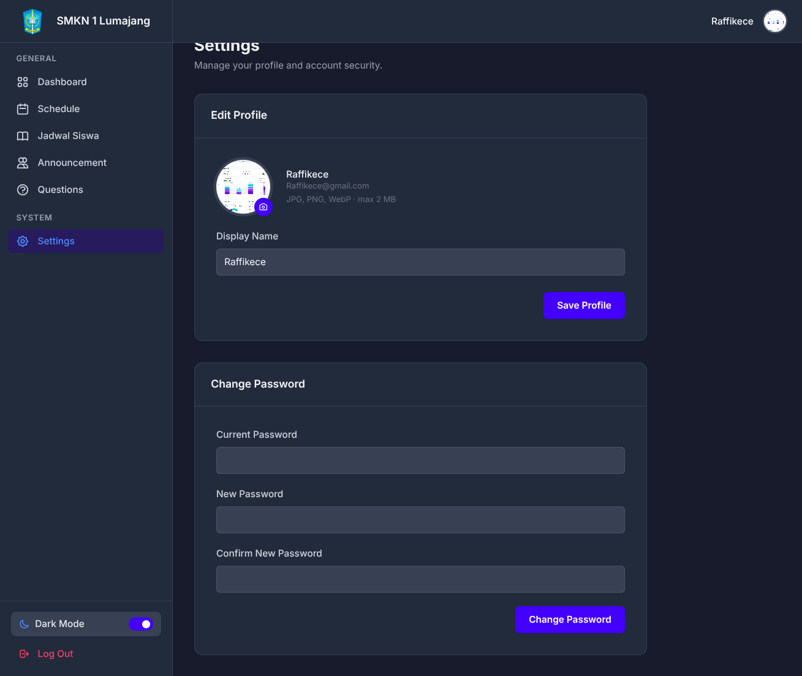

# 🎓 SMKN 1 Lumajang Management System



A modern, fast, and responsive web application designed for managing school operations at SMKN 1 Lumajang. It features an intuitive Teacher dashboard, advanced Schedule management, and a robust API backend tailored to power the companion Flutter mobile application.

---

## ✨ Features Overview

### 📊 Interactive Dashboard (Light & Dark Mode)
A comprehensive, real-time overview detailing your critical statistics.
- **Dynamic Theming**: Fully supported system-wide Dark Mode that remembers user preference.
- **KPI Metrics**: Track total schedules, active announcements, total question sets, and user statistics at a glance.
- **Activity Feed**: View today's classes and latest announcements seamlessly.



### 📅 Advanced Schedule Management
Create and organize teaching schedules with an intuitive, fast interface.
- Includes a dedicated **history system** that automatically archives older schedules (over 1 week).
- Re-activate schedules from history by editing and updating them.



### 🏫 Student Schedules (Flutter Backend Support)
A dedicated module for managing student-specific schedules mapped closely to the API endpoint for the Flutter mobile application.
- Complete CRUD operations tailored per-class and major.
- Features multi-tenancy capabilities so students only receive their relevant information.



### 📢 School Announcements
A robust announcement broadcast system.
- Determine priorities (Low, Medium, High).
- Set target audiences and schedule publish dates.
- Keep the community up to date with a built-in auto-archiving history system.



### 📝 Question Sets & Quizzes
A unified test-building tool allowing educators to draft question sets with multiple-choice answers mapping directly to tests.
- Autogenerated unique `key_codes` for quiz distribution.
- Manage individual questions and specify correctness intuitively.



### ⚙️ Profile & System Settings
Manage your identity securely.
- Easily update your profile photo, name, and securely encrypt and change your password.



---

## 🛠️ Tech Stack

This project uses the modern **TALL**-adjacent stack designed for speed and aesthetic excellence:

- **Backend:** Laravel 12 & PHP 8.2+
- **Frontend Framework:** Tailwind CSS 4.0 (via Vite)
- **Interactivity:** Alpine.js (for reactive modals, toggles, loading screens, and dark-mode)
- **Database:** SQLite (default / development-ready)
- **Icons & Fonts:** SVG Heroicons & Inter typography

---

## 🚀 Installation & Setup

1. **Clone the repository**
   ```bash
   git clone <repository-url>
   cd web-project
   ```

2. **Install dependencies**
   ```bash
   composer install
   npm install
   ```

3. **Configure Environment**
   ```bash
   cp .env.example .env
   php artisan key:generate
   ```

4. **Prepare the Database**
   ```bash
   php artisan migrate:fresh --seed
   ```
   > The seeder will automatically create a `superadmin@gmail.com` account (Password: `password123`).

5. **Start Development Servers**
   ```bash
   npm run dev
   # In a separate terminal:
   php artisan serve
   ```

---

## 🔗 Route Authorization & Structure

The system implements multiple levels of security, unifying both Web Management and Mobile APIs:

| Sector | Route | Access | Purpose |
|--------|-------|--------|---------|
| **Web**| `/login` | Guest | Teacher / Admin Web Portal authentication. |
| **Web**| `/dashboard` | Protected (`auth`) | Home dashboard and daily summary. |
| **Web**| `/schedule` | Protected (`auth`) | Teacher personal classes. |
| **Web**| `/announcement` | Protected (`role:admin,teacher`) | Full administrative broadcast privileges. |
| **API**| `/student` | Protected API | Endpoints specifically connecting to the internal Flutter application backend. |

---

## 📜 License
MIT License. Inspired and built for modern administrative convenience.
